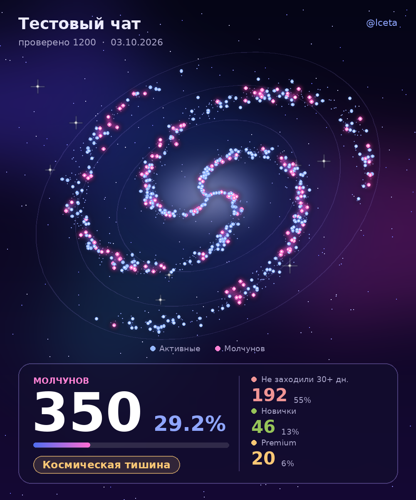

<p align="center">
  
</p>

<p align="center">
  
  
  
  
</p>

<p align="center">
  <b>🇷🇺 Русский</b> · <a href="#-english">🇬🇧 English</a>
</p>

---

# 🪐 CMC — статистика чата и молчуны

Модуль для **Hikka / Heroku** userbot. Считает сообщения и медиа, показывает статистику чата и находит **молчунов** — участников, которые не написали ни одного сообщения. Отчёт приходит красивым HTML-файлом, а если в чате запрещены файлы, то картинкой-карточкой.

<p align="center">
  
</p>

## ✨ Возможности

- 📊 Статистика сообщений и медиа: свои, любого пользователя или всех участников сразу
- 🏷 Статистика чата: участники, админы, удалённые аккаунты, фото/видео, GIF, голосовые, файлы
- 🤫 Поиск молчунов с HTML-отчётом: поиск, фильтры, выбор людей, копирование ников, выгрузка в CSV
- 🖼 Аватарки в отчёте (маленькие и лёгкие, по желанию)
- 🌌 Карточка-галактика, если в чате нельзя отправлять файлы
- 💾 Результат `.silent` запоминается на 15 минут, повторный запуск не сканирует чат заново
- 🔄 Обновление одной командой

## 📥 Установка

```
.dlm https://raw.githubusercontent.com/lcetaa/CMC-heroku-bot/refs/heads/main/cmc.py
```

## 🧾 Команды

| Команда | Что делает |
|---|---|
| `.mymsg` | ваши сообщения и медиа в чате |
| `.usermsg` | сообщения пользователя (реплаем, `@username` или ID) |
| `.allmsg` | сообщения всех участников |
| `.chatstats` | статистика чата |
| `.silent` | молчуны + HTML-отчёт |
| `.cmcupdate` | проверить и установить обновление. `-f` / `--force` ставит сразу |

## 🤫 Как работает `.silent`

1. Модуль проверяет каждого участника и находит тех, у кого нет сообщений.
2. Отправляет HTML-отчёт в чат.
3. Если файлы в чате запрещены, отправляет карточку-картинку: число молчунов, их доля, «не заходили 30+ дней», новички, Premium и вердикт по чату.
4. Если запрещены и фото, отчёт уходит в `report_chat`, а если он не задан, то в «Избранное».

В HTML-отчёте: поиск по имени или `@username`, фильтры (все, давно не заходили, новички, Premium), выбор людей, копирование ников, скачивание CSV, график по дате вступления.

## ⚙️ Настройки

Открываются командой `.cfg CMC`.

| Параметр | Описание |
|---|---|
| `report_chat` | ID группы, куда дублировать файл `.silent` |
| `report_topic` | ID топика в этой группе (General = 1) |
| `report_photos` | вставлять аватарки в HTML-отчёт (файл станет тяжелее) |

## 🧰 Требования

- Для карточки-картинки нужен **Pillow** (обычно уже стоит вместе с юзерботом).
- Для русских букв на картинке нужен шрифт DejaVu: `sudo apt install fonts-dejavu-core`.

## 🔄 Обновление

```
.cmcupdate
```

Если версия последняя, появятся кнопки «Обновить всё равно» и «Отмена».

---

<a name="-english"></a>

# 🪐 CMC — chat stats and lurkers

A module for the **Hikka / Heroku** userbot. It counts messages and media, shows chat statistics and finds **lurkers**: members who have never written a message. The report arrives as a nice HTML file, or as a picture card if files are forbidden in the chat.

## ✨ Features

- 📊 Message and media stats: yours, any user's, or all members at once
- 🏷 Chat stats: members, admins, deleted accounts, photos/videos, GIFs, voice messages, files
- 🤫 Lurker search with an HTML report: search, filters, selection, username copy, CSV export
- 🖼 Optional lightweight avatars in the report
- 🌌 A galaxy card when the chat doesn't allow files
- 💾 `.silent` results are cached for 15 minutes, so a repeat run doesn't rescan the chat
- 🔄 One-command updates

## 📥 Install

```
.dlm https://raw.githubusercontent.com/lcetaa/CMC-heroku-bot/refs/heads/main/cmc.py
```

## 🧾 Commands

| Command | What it does |
|---|---|
| `.mymsg` | your messages and media in the chat |
| `.usermsg` | a user's messages (reply, `@username` or ID) |
| `.allmsg` | messages of all members |
| `.chatstats` | chat statistics |
| `.silent` | lurkers + HTML report |
| `.cmcupdate` | check for and install an update. `-f` / `--force` installs right away |

## 🤫 How `.silent` works

1. The module checks every member and finds those with no messages.
2. It sends the HTML report to the chat.
3. If files are forbidden, it sends a picture card instead: lurker count and share, inactive 30+ days, newcomers, Premium and a verdict.
4. If photos are forbidden too, the report goes to `report_chat`, or to Saved Messages if it isn't set.

## ⚙️ Config

Open with `.cfg CMC`.

| Option | Description |
|---|---|
| `report_chat` | Group ID to send a copy of the `.silent` file to |
| `report_topic` | Topic ID in that group (General = 1) |
| `report_photos` | embed avatars into the HTML report (the file gets heavier) |

## 🧰 Requirements

- The picture card needs **Pillow** (usually installed with the userbot).
- Cyrillic text on the card needs the DejaVu font: `sudo apt install fonts-dejavu-core`.

---

<p align="center">Made with 🪐 by <a href="https://t.me/lceta">@lceta</a></p>
